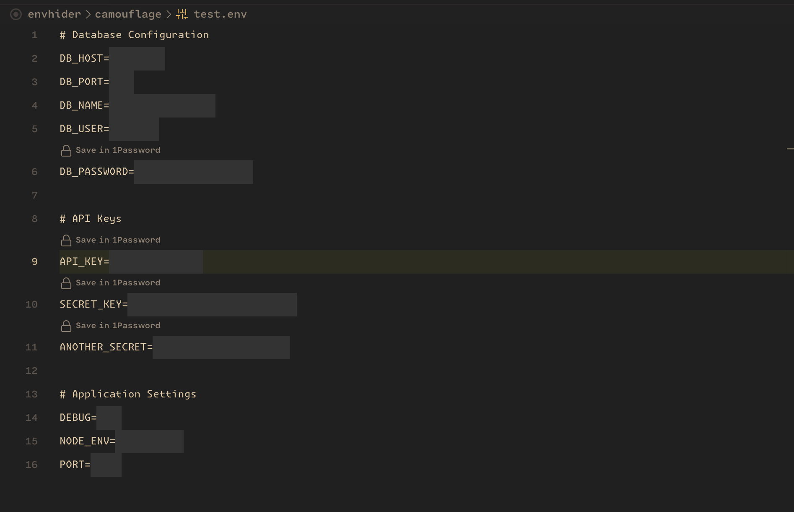

# Camouflage - Environment Value Hider



[](https://github.com/zeybek/camouflage/actions/workflows/ci.yml)
[](https://github.com/zeybek/camouflage/actions/workflows/codeql.yml)
[](https://opensource.org/licenses/MIT)
[](https://marketplace.visualstudio.com/items?itemName=zeybek.camouflage)
[](https://codecov.io/gh/zeybek/camouflage)

Camouflage is a VS Code extension that helps protect sensitive environment variables by hiding their values in `.env` files. Perfect for screen sharing, recordings, or taking screenshots without exposing sensitive information.

## Features

- 🔒 **Automatic Value Hiding**: Automatically hides values in `.env` files while preserving the keys
- 🎨 **Multiple Hiding Styles**: Choose from different styles to hide your values:
  - Text (default): `************************`
  - Dotted: `••••••••••••`
  - Stars: `************`
  - Custom: Define your own pattern (e.g., `###`)
- 🎯 **Quick Toggle**: Easily toggle visibility via status bar or context menu
- 🌈 **Customizable Appearance**: Configure colors and patterns to match your theme
- 👁️ **Value Preview**: Optional value preview on hover
- 📁 **Flexible File Support**: Works with various `.env` file formats
- 🔍 **Selective Hiding**: Hide only specific keys based on patterns or exclude certain keys
- ⌨️ **Keyboard Shortcuts**: Quickly toggle visibility with customizable keyboard shortcuts
- 🖱️ **Enhanced Context Menu**: Right-click on any value to toggle its visibility
- 📊 **Status Bar Indicators**: See the current state and mode at a glance
- 🔐 **Password Protection**: Add an extra layer of security with password protection for viewing sensitive values

## Installation

1. Open VS Code
2. Press `Ctrl+P` / `Cmd+P`
3. Type `ext install zeybek.camouflage`
4. Press Enter

## Requirements

- VS Code 1.96.0 or higher

## Usage

### Basic Usage

1. Open any `.env` file
2. Values are automatically hidden (if auto-hide is enabled)
3. Use the status bar toggle to show/hide values
4. Right-click in the editor for context menu options

### Status Bar Control

The extension adds a status bar item that shows the current state:

- 👁️‍🗨️ **Camouflage: On** - All values are hidden
- 👁️‍🗨️ **Camouflage: Selective** - Only selected values are hidden
- 👁️ **Camouflage: Off** - Values are visible

Click the status bar item to toggle between On/Off states.

### Context Menu Options

Right-click on any line in your `.env` file to access these options:

- **Hide/Reveal Environment Variables**: Toggle global hiding
- **Toggle Selected Value**: Toggle visibility for the current value only
- **Toggle Selective Hiding**: Switch between hiding all values or only selected ones
- **Add to Exclude List**: Add the current key to the exclude list
- **Set Protection Password**: Configure password protection for sensitive values
- **Clear Remembered Password**: Clear the remembered password for the current session

### Keyboard Shortcuts

- `Ctrl+Shift+H` / `Cmd+Shift+H`: Hide all values
- `Ctrl+Shift+R` / `Cmd+Shift+R`: Reveal all values
- `Ctrl+Shift+T` / `Cmd+Shift+T`: Toggle the value under cursor
- `Ctrl+Shift+S` / `Cmd+Shift+S`: Toggle selective hiding mode
- `Ctrl+Shift+P` / `Cmd+Shift+P`: Set protection password

## Configuration

Access settings through:

- Command Palette (`Ctrl+Shift+P` / `Cmd+Shift+P`) → "Preferences: Open Settings (UI)"
- Search for "Camouflage"

### Available Settings

#### General

- `camouflage.enabled`: Enable/disable the extension
- `camouflage.autoHide`: Automatically hide values when opening files

#### Files

- `camouflage.files.patterns`: File patterns to apply hiding (e.g., .env, .env.local)

#### Appearance

- `camouflage.appearance.style`: Hiding style (text, dotted, stars)
- `camouflage.appearance.hiddenText`: Text to display for hidden values
- `camouflage.appearance.textColor`: Color of hidden text
- `camouflage.appearance.backgroundColor`: Background color for hidden values

#### Selective Hiding

- `camouflage.selective.enabled`: Enable selective hiding mode (only hide keys matching patterns)
- `camouflage.selective.keyPatterns`: Patterns to match keys that should be hidden
- `camouflage.selective.excludeKeys`: Patterns to match keys that should never be hidden

#### Hover

- `camouflage.hover.showPreview`: Show value preview on hover
- `camouflage.hover.message`: Custom message to show on hover

#### Security

- `camouflage.security.passwordProtection`: Enable password protection for viewing sensitive values
- `camouflage.security.passwordTimeout`: Time in seconds before requiring password again (0 for no timeout)
- `camouflage.security.maxAttempts`: Maximum number of password attempts before locking (0 for unlimited)
- `camouflage.security.rememberPassword`: Remember password for the current session

## Examples

### Different Styles

```env
# Text Style (Default)
API_KEY=************************

# Dotted Style
SECRET_KEY=••••••••••••

# Stars Style
PASSWORD=************
```

### Selective Hiding

You can configure Camouflage to only hide specific keys by enabling selective hiding:

```json
// Enable selective hiding
"camouflage.selective.enabled": true,

// Define patterns for keys to hide
"camouflage.selective.keyPatterns": [
  "*KEY*",   // Contains "KEY" anywhere (e.g., API_KEY, KEY_VALUE, MY_KEY_HERE)
  "API*",    // Starts with "API" (e.g., API_KEY, API_SECRET)
  "*SECRET", // Ends with "SECRET" (e.g., JWT_SECRET, CLIENT_SECRET)
  "PASSWORD", // Exact match only (only "PASSWORD", not "DB_PASSWORD")
  "DB*",     // Starts with "DB" (e.g., DB_HOST, DB_USER)
  "*DB*",    // Contains "DB" anywhere (e.g., MONGODB_URI, RDS_DB_NAME)
  "DATABASE*", // Starts with "DATABASE" (e.g., DATABASE_URL)
  "*DATABASE*", // Contains "DATABASE" anywhere (e.g., MY_DATABASE_PASSWORD)
  "PORT"     // Exact match only (only "PORT", not "REPORT")
],

// Define patterns for keys to never hide
"camouflage.selective.excludeKeys": [
  "PUBLIC*", // Starts with "PUBLIC" (e.g., PUBLIC_URL, PUBLIC_KEY)
  "*_TEST",  // Ends with "_TEST" (e.g., API_TEST, SECRET_TEST)
  "DEBUG"    // Exact match only (only "DEBUG")
]
```

#### Pattern Matching Rules

The same pattern matching rules apply to both `keyPatterns` and `excludeKeys`:

- `*KEY*` - Matches keys containing "KEY" anywhere
- `KEY*` - Matches keys starting with "KEY"
- `*KEY` - Matches keys ending with "KEY"
- `KEY` - Matches only the exact key "KEY"

With these settings:

```env
# This will be hidden (matches *KEY* pattern)
API_KEY=hidden_value

# This will be hidden (matches API* pattern)
API_SECRET=hidden_value

# This will be hidden (matches *SECRET pattern)
JWT_SECRET=hidden_value

# This will NOT be hidden (doesn't match any pattern)
SOME_VALUE=visible_value

# This will NOT be hidden (matches PUBLIC* exclude pattern)
PUBLIC_URL=https://example.com

# This will NOT be hidden (matches *_TEST exclude pattern)
API_TEST=test_value

# This will NOT be hidden (matches DEBUG exclude pattern)
DEBUG=true
```

When selective hiding is disabled, all values will be hidden regardless of their keys (except those matching exclude patterns).

### Quick Value Toggling

You can quickly toggle individual values by:

1. Placing your cursor on the line containing the value
2. Right-clicking and selecting "Toggle Selected Value" from the context menu
3. Or using the keyboard shortcut `Ctrl+Shift+T` / `Cmd+Shift+T`

When toggling a value, you'll be prompted to choose a pattern type:

- **Exact match**: Only affects the specific key (e.g., "API_KEY")
- **Starts with**: Affects all keys starting with the pattern (e.g., "API\_\*")
- **Ends with**: Affects all keys ending with the pattern (e.g., "\*\_KEY")
- **Contains**: Affects all keys containing the pattern (e.g., "_KEY_")

This adds or removes the selected pattern from the exclude list, effectively toggling visibility for all matching keys.

### Adding to Exclude List

You can also add keys to the exclude list without removing existing patterns:

1. Place your cursor on the line containing the value
2. Right-click and select "Add to Exclude List" from the context menu
3. Choose the pattern type (exact match, starts with, ends with, or contains)

This gives you more control over which values are hidden or visible based on your specific needs.

### Password Protection

For an additional layer of security, you can enable password protection to prevent unauthorized viewing of sensitive values:

1. Enable password protection in settings: `camouflage.security.passwordProtection: true`
2. Set a password by right-clicking in an `.env` file and selecting "Set Protection Password" or using the keyboard shortcut `Ctrl+Shift+P` / `Cmd+Shift+P`
3. When you try to reveal hidden values, you'll be prompted to enter the password

#### Password Protection Features

- **Session Timeout**: Configure how long the password is remembered before requiring re-entry (`camouflage.security.passwordTimeout`)
- **Maximum Attempts**: Set a limit on incorrect password attempts to prevent brute force attacks (`camouflage.security.maxAttempts`)
- **Remember Password**: Choose whether to remember the password for the current session (`camouflage.security.rememberPassword`)
- **Clear Password**: Manually clear the remembered password via the context menu

This feature is perfect for:

- Shared workstations where multiple people might have access to your VS Code
- Live coding sessions or presentations where you need to temporarily reveal sensitive values
- Adding an extra layer of protection against accidental exposure of sensitive information

## Security

### Visual Protection Only

Camouflage only hides values visually in the editor. The actual file content remains unchanged. Always be cautious when sharing your screen or taking screenshots.

### Reporting Security Issues

If you discover a security vulnerability, please follow our [security policy](SECURITY.md) for responsible disclosure.

## Contributing

This extension is open source and available on [GitHub](https://github.com/zeybek/camouflage). Contributions are welcome!

1. Fork the repository
2. Create a feature branch
3. Make your changes
4. Run tests with `npm test`
5. Ensure code passes linting with `npm run lint`
6. Submit a pull request

Please see our [contributing guidelines](CONTRIBUTING.md) for more details.

## License

This extension is released under the [MIT License](LICENSE).

## Support

If you encounter any issues or have suggestions:

- File an issue on [GitHub](https://github.com/zeybek/camouflage/issues)
- Contact: [Ahmet Zeybek](https://github.com/zeybek)

## Changelog

See the [CHANGELOG.md](CHANGELOG.md) file for details on each release.

---

**Enjoy hiding your sensitive environment values with Camouflage!**
