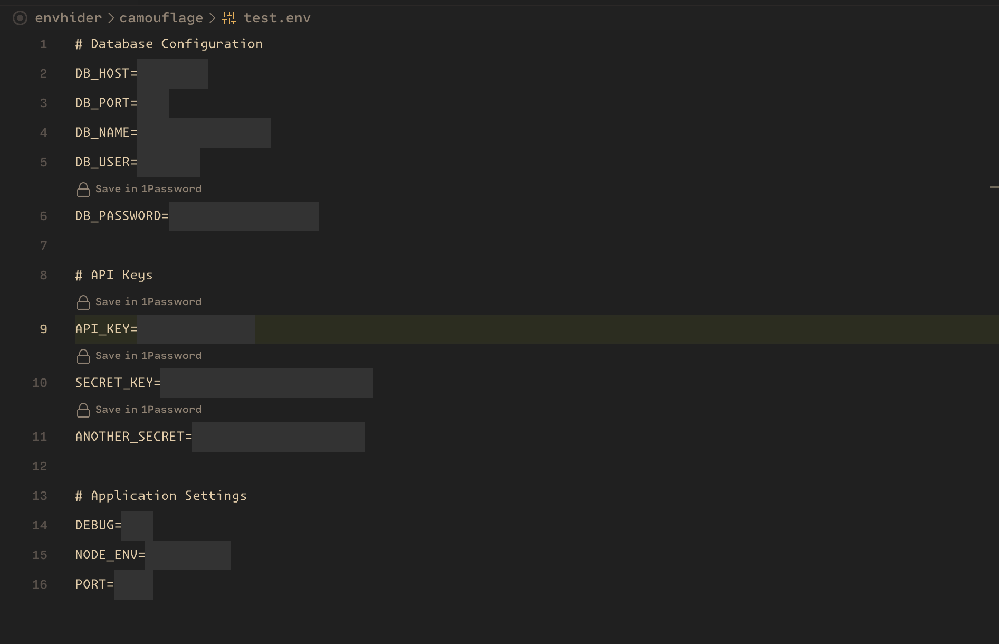

# Camouflage - Configuration Value Hider



[](https://github.com/zeybek/camouflage/actions/workflows/ci.yml)
[](https://github.com/zeybek/camouflage/actions/workflows/codeql.yml)
[](https://opensource.org/licenses/MIT)
[](https://marketplace.visualstudio.com/items?itemName=zeybek.camouflage)
[](https://codecov.io/gh/zeybek/camouflage)

Camouflage is a VS Code extension that helps protect sensitive values in configuration files by hiding them visually. Supports multiple file formats including `.env`, `.json`, `.yaml`, `.properties`, `.toml`, and `.sh` files. Perfect for screen sharing, recordings, or taking screenshots without exposing sensitive information.

## Features

- 🔒 **Automatic Value Hiding**: Automatically hides values in configuration files while preserving the keys
- 📁 **Multi-Format Support**: Works with `.env`, `.json`, `.yaml`, `.yml`, `.properties`, `.ini`, `.conf`, `.toml`, and `.sh` files
- 🔗 **Nested Key Support**: Supports nested keys in JSON and YAML files (e.g., `database.password`)
- 🎨 **Multiple Hiding Styles**: Choose from different styles to hide your values:
  - Text (default): `************************`
  - Dotted: `••••••••••••`
  - Stars: `************`
  - Scramble: `sroedpaswd` (randomly shuffled characters)
  - Custom: Define your own pattern (e.g., `###`)
- 🎯 **Quick Toggle**: Easily toggle visibility via status bar or context menu
- 🌈 **Customizable Appearance**: Configure colors and patterns to match your theme
- 👁️ **Value Preview**: Optional value preview on hover
- 🔍 **Selective Hiding**: Hide only specific keys based on patterns or exclude certain keys
- 📂 **File Exclusion**: Exclude specific files from Camouflage protection
- ⌨️ **Keyboard Shortcuts**: Quickly toggle visibility with customizable keyboard shortcuts
- 🖱️ **Organized Context Menu**: All options grouped under a single "Camouflage" menu
- 📊 **Status Bar Indicators**: See the current state and mode at a glance
- 🔧 **Indented Code Support**: Works with indented export statements in shell scripts
- 🧩 **Robust Value Coverage**: Hides multi-line values (YAML block scalars, TOML triple-quoted strings, `.env` line continuations, PEM keys), arrays, numbers, and escaped/special characters — not just simple single-line strings

## Supported File Formats

| Format        | Extensions                          | Nested Keys    |
| ------------- | ----------------------------------- | -------------- |
| Environment   | `.env`, `.env.*`, `*.env`, `.envrc` | No             |
| Shell Scripts | `.sh`                               | No             |
| JSON          | `.json`                             | Yes            |
| YAML          | `.yaml`, `.yml`                     | Yes            |
| Properties    | `.properties`, `.ini`, `.conf`      | No             |
| TOML          | `.toml`                             | Yes (sections) |

## Installation

1. Open VS Code
2. Press `Ctrl+P` / `Cmd+P`
3. Type `ext install zeybek.camouflage`
4. Press Enter

## Requirements

- VS Code 1.96.0 or higher

## Usage

### Basic Usage

1. Open any supported configuration file (`.env`, `.json`, `.yaml`, etc.)
2. Values are automatically hidden (when Camouflage is enabled)
3. Use the status bar toggle to show/hide values
4. Right-click in the editor for context menu options

### Status Bar Control

The extension adds a status bar item that shows the current state:

- 👁️‍🗨️ **Camouflage: On** - All values are hidden
- 👁️‍🗨️ **Camouflage: Selective** - Only selected values are hidden
- 👁️ **Camouflage: Off** - Values are visible

Click the status bar item to toggle between On/Off states.

### Context Menu Options

Right-click on any line in your configuration file to access the **Camouflage** submenu with these organized options:

```
🎭 Camouflage
├── Hide Values / Reveal Values     ← Toggle global hiding
├─────────────────────────────────
├── Toggle This Value               ← Toggle current value visibility
├── Exclude This Key                ← Add key to exclude list
├─────────────────────────────────
├── Toggle Selective Mode           ← Switch hiding mode
├─────────────────────────────────
├── Exclude This File               ← Stop hiding in current file
├── Include This File               ← Resume hiding in current file
├─────────────────────────────────
└── Change Style →                  ← Submenu for hiding styles
    ├── Text
    ├── Dotted
    ├── Stars
    └── Scramble
```

**Hiding Styles:**

- **Text**: Standard text replacement (e.g., `************************`)
- **Dotted**: Uses dot characters (e.g., `••••••••••••`)
- **Stars**: Uses asterisk characters (e.g., `************`)
- **Scramble**: Randomly shuffles characters (e.g., `sroedpasw`)

> **Note:** Scramble only reorders the existing characters, so it still reveals the value's length and character set. Prefer the Text style (fixed-width mask) when even those should stay hidden.

### Keyboard Shortcuts

- `Ctrl+Shift+H` / `Cmd+Shift+H`: Hide all values
- `Ctrl+Shift+R` / `Cmd+Shift+R`: Reveal all values
- `Ctrl+Shift+T` / `Cmd+Shift+T`: Toggle the value under cursor
- `Ctrl+Shift+S` / `Cmd+Shift+S`: Toggle selective hiding mode
- `Ctrl+Shift+E` / `Cmd+Shift+E`: Edit the camouflaged value under the cursor

## Configuration

Access settings through:

- Command Palette (`Ctrl+Shift+P` / `Cmd+Shift+P`) → "Preferences: Open Settings (UI)"
- Search for "Camouflage"

### Available Settings

#### General

- `camouflage.enabled`: Enable/disable the extension

#### Files

- `camouflage.files.patterns`: File patterns to apply hiding (e.g., `.env*`, `*.json`, `*.yaml`)
- `camouflage.files.excludedFiles`: List of file paths to exclude from Camouflage (absolute or relative paths)

#### Parser Options

- `camouflage.parsers.enabled`: Formats to parse (`env`, `json`, `yaml`, `properties`, `toml`)
- `camouflage.parsers.json.nestedDepth`: Maximum nesting depth for JSON keys (default: 10)
- `camouflage.parsers.yaml.nestedDepth`: Maximum nesting depth for YAML keys (default: 10)

#### Editing

- `camouflage.editing.enableDoubleClickEdit`: Double-click a camouflaged value to edit it via an input box, keeping it hidden in the editor (default: true)

#### Appearance

- `camouflage.appearance.style`: Hiding style (text, dotted, stars, scramble)
- `camouflage.appearance.hiddenText`: Text to display for hidden values
- `camouflage.appearance.textColor`: Color of hidden text
  - `auto`: Automatically uses your current theme's text color
  - Custom CSS color: Use any valid CSS color value (e.g., `#FFFFFF`, `white`, `rgba(255,255,255,0.8)`)
- `camouflage.appearance.backgroundColor`: Background color for hidden values
  - `auto`: Automatically uses your current theme's primary color
  - `transparent`: No background color
  - Custom CSS color: Use any valid CSS color value (e.g., `#2F7FE5`, `red`, `rgba(255,0,0,0.5)`)

#### Selective Hiding

- `camouflage.selective.enabled`: Enable selective hiding mode (only hide keys matching patterns)
- `camouflage.selective.keyPatterns`: Patterns to match keys that should be hidden
- `camouflage.selective.excludeKeys`: Patterns to match keys that should never be hidden

#### Hover

- `camouflage.hover.showPreview`: Show value preview on hover
- `camouflage.hover.message`: Custom message to show on hover

## Examples

### Multi-Format Support

Camouflage works seamlessly across different configuration file formats:

#### Environment Files (.env)

```env
# All values are hidden
API_KEY=************************
DATABASE_URL=************************
SECRET_TOKEN=************************
```

#### JSON Files (.json)

```json
{
  "apiKey": "************************",
  "database": {
    "host": "************************",
    "password": "************************"
  }
}
```

Nested keys are displayed as `database.host`, `database.password` in hover messages.

#### YAML Files (.yaml)

```yaml
api:
  key: '************************'
database:
  host: '************************'
  password: '************************'
```

#### Shell Scripts (.sh)

```bash
#!/bin/bash
export API_KEY=************************
export DATABASE_URL=************************
DB_PASSWORD=************************
```

#### Properties Files (.properties)

```properties
api.key=************************
database.host=************************
database.password=************************
```

#### TOML Files (.toml)

```toml
[database]
host = "************************"
password = "************************"

[api]
key = "************************"
```

#### Multi-line & Complex Values

Values that span multiple lines, live in arrays, or contain escaped/special characters are hidden too:

```yaml
tls:
  # The entire block scalar (e.g. a PEM key) is hidden, not just the first line
  privateKey: |
    ************************
    ************************
apiKeys:
  - ************************
  - ************************
```

The same applies to TOML triple-quoted (`"""`) strings, `.env` multi-line / `\`-continued values, numbers, and strings containing quotes or backslashes.

### Different Hiding Styles

```env
# Text Style (Default)
API_KEY=************************

# Dotted Style
SECRET_KEY=••••••••••••

# Stars Style
PASSWORD=************

# Scramble Style
DATABASE_URL=ettsaab:dlocmonpg///:
```

### Selective Hiding

You can configure Camouflage to only hide specific keys by enabling selective hiding:

```json
// Enable selective hiding
"camouflage.selective.enabled": true,

// Define patterns for keys to hide
"camouflage.selective.keyPatterns": [
  "*KEY*",   // Contains "KEY" anywhere (e.g., API_KEY, KEY_VALUE, MY_KEY_HERE)
  "API*",    // Starts with "API" (e.g., API_KEY, API_SECRET)
  "*SECRET", // Ends with "SECRET" (e.g., JWT_SECRET, CLIENT_SECRET)
  "PASSWORD", // Exact match only (only "PASSWORD", not "DB_PASSWORD")
  "*password*", // Contains "password" (works with nested keys like database.password)
  "DB*",     // Starts with "DB" (e.g., DB_HOST, DB_USER)
  "*DB*",    // Contains "DB" anywhere (e.g., MONGODB_URI, RDS_DB_NAME)
  "DATABASE*", // Starts with "DATABASE" (e.g., DATABASE_URL)
  "*DATABASE*", // Contains "DATABASE" anywhere (e.g., MY_DATABASE_PASSWORD)
  "PORT"     // Exact match only (only "PORT", not "REPORT")
],

// Define patterns for keys to never hide
"camouflage.selective.excludeKeys": [
  "PUBLIC*", // Starts with "PUBLIC" (e.g., PUBLIC_URL, PUBLIC_KEY)
  "*_TEST",  // Ends with "_TEST" (e.g., API_TEST, SECRET_TEST)
  "DEBUG"    // Exact match only (only "DEBUG")
]
```

#### Pattern Matching Rules

The same pattern matching rules apply to both `keyPatterns` and `excludeKeys`:

- `*KEY*` - Matches keys containing "KEY" anywhere
- `KEY*` - Matches keys starting with "KEY"
- `*KEY` - Matches keys ending with "KEY"
- `KEY` - Matches only the exact key "KEY"
- `API*KEY` - Wildcards work mid-pattern too (matches `API_KEY`, `API_SECRET_KEY`, …)

**Note**: For nested keys (JSON/YAML), the full key path is used for matching. For example, `database.password` can be matched with `*password*` or `database.*`.

With these settings:

```env
# This will be hidden (matches *KEY* pattern)
API_KEY=hidden_value

# This will be hidden (matches API* pattern)
API_SECRET=hidden_value

# This will be hidden (matches *SECRET pattern)
JWT_SECRET=hidden_value

# This will NOT be hidden (doesn't match any pattern)
SOME_VALUE=visible_value

# This will NOT be hidden (matches PUBLIC* exclude pattern)
PUBLIC_URL=https://example.com

# This will NOT be hidden (matches *_TEST exclude pattern)
API_TEST=test_value

# This will NOT be hidden (matches DEBUG exclude pattern)
DEBUG=true
```

When selective hiding is disabled, all values will be hidden regardless of their keys (except those matching exclude patterns).

### Quick Value Toggling

You can quickly toggle individual values by:

1. Placing your cursor on the line containing the value
2. Right-clicking and selecting "Toggle Selected Value" from the context menu
3. Or using the keyboard shortcut `Ctrl+Shift+T` / `Cmd+Shift+T`

When toggling a value, you'll be prompted to choose a pattern type:

- **Exact match**: Only affects the specific key (e.g., "API_KEY")
- **Starts with**: Affects all keys starting with the pattern (e.g., "API\_\*")
- **Ends with**: Affects all keys ending with the pattern (e.g., "\*\_KEY")
- **Contains**: Affects all keys containing the pattern (e.g., "_KEY_")

This adds or removes the selected pattern from the exclude list, effectively toggling visibility for all matching keys.

### Adding to Exclude List

You can also add keys to the exclude list without removing existing patterns:

1. Place your cursor on the line containing the value
2. Right-click and select "Add to Exclude List" from the context menu
3. Choose the pattern type (exact match, starts with, ends with, or contains)

This gives you more control over which values are hidden or visible based on your specific needs.

### File Exclusion

You can exclude specific files from Camouflage protection:

#### Using Context Menu

1. Open the file you want to exclude
2. Right-click → **Camouflage** → **Exclude This File**
3. The file will no longer be processed by Camouflage

To include a file again:

1. Open the excluded file
2. Right-click → **Camouflage** → **Include This File**

#### Using Settings

```json
// Exclude specific files from Camouflage
"camouflage.files.excludedFiles": [
  "/path/to/public-config.json",
  "examples/sample.env",
  "test-fixtures/config.yaml"
]
```

This is useful when you have configuration files that don't contain sensitive data and should always be visible.

### Configuring Parsers

You can enable or disable specific parsers based on your needs:

```json
// Enable only specific parsers
"camouflage.parsers.enabled": ["env", "json", "yaml"],

// Configure nested key depth (JSON and YAML are separate settings)
"camouflage.parsers.json.nestedDepth": 10,
"camouflage.parsers.yaml.nestedDepth": 10
```

## Security

### Visual Protection Only

Camouflage hides values **visually in the editor only** — it is a screen-sharing/screenshot aid, **not** encryption or access control. The real values stay in the file unchanged, so they are still fully visible to:

- **Copy/paste** and the clipboard (copying a hidden value copies the real text)
- **Find-in-files**, Git diffs/blame, and version control
- Other extensions, the integrated terminal, and any process that can read the file

Never rely on Camouflage to protect secrets from anything other than someone _looking at your screen_. Use real secret management (env vars, vaults, `.gitignore`) for actual protection.

### Reporting Security Issues

If you discover a security vulnerability, please follow our [security policy](SECURITY.md) for responsible disclosure.

## Contributing

This extension is open source and available on [GitHub](https://github.com/zeybek/camouflage). Contributions are welcome!

1. Fork the repository
2. Create a feature branch
3. Make your changes
4. Run tests with `npm test`
5. Ensure code passes linting with `npm run lint`
6. Submit a pull request

Please see our [contributing guidelines](CONTRIBUTING.md) for more details.

## License

This extension is released under the [MIT License](LICENSE).

## Support

If you encounter any issues or have suggestions:

- File an issue on [GitHub](https://github.com/zeybek/camouflage/issues)
- Contact: [Ahmet Zeybek](https://github.com/zeybek)

## Changelog

See the [CHANGELOG.md](CHANGELOG.md) file for details on each release.

---

**Enjoy hiding your sensitive configuration values with Camouflage!**
